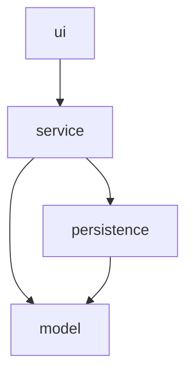

# GameZone Unicesar

Inventory, people, and sales management system for GameZone Unicesar, developed as Taller 2 for Programación de Computadores III (SS462), Ingeniería de Sistemas, Universidad Popular del Cesar.

## About

GameZone Unicesar is a video game and console store located in Valledupar's university sector. The system registers products (video games and consoles), people (customers and sellers), and sales, automatically updating inventory whenever a sale is registered.

It is a Java console application built on a strict four-layer architecture (`model`, `persistence`, `service`, `ui`), with file-based persistence through Java serialization, so data survives between runs without requiring a database.

## Architecture

The codebase is organized into four layers under the root package `com.gamezone`, with a strict, one-directional dependency rule: `ui → service → persistence → model`.

- `model` depends on nothing else.
- `persistence` depends only on `model`.
- `service` depends on `model` and `persistence`.
- `ui` depends only on `service`.

See the full diagram and rationale in [docs/layers-diagram.md](docs/layers-diagram.md).



### Design note: SaleRecord

Persisted sales do not store full `Customer`, `Seller`, and `Product` objects — they store only their ids, through a DTO called `SaleRecord`. This prevents `persistence` from depending on `service` to resolve those references (which would break the architecture rule above) and avoids duplicated, potentially desynchronized copies of the same entity across different files. The resolution of ids into full objects happens in `SaleService`. See the full rationale in [docs/analysis.md](docs/analysis.md).

## Requirements

- Java 17 or later
- Maven 3.8 or later

## Build

```
mvn clean compile
```

## Run

```
mvn exec:java "-Dexec.mainClass=com.gamezone.Main"
```

Data files under `data/` are created and updated automatically through Java serialization (`ObjectOutputStream`/`ObjectInputStream`). On first run, the system automatically preloads 3 sellers into `data/sellers.dat`.

## Repository structure

```
GameZoneUnicesar/
├── README.md
├── TEAM.md
├── pom.xml
├── .gitignore
├── src/
│   └── main/
│       └── java/
│           └── com/
│               └── gamezone/
│                   ├── model/
│                   ├── persistence/
│                   ├── service/
│                   ├── ui/
│                   └── Main.java
├── data/
└── docs/
    ├── analysis.md
    ├── hierarchy-diagram.md
    ├── class-diagram.md
    ├── layers-diagram.md
    └── ai-usage/
        ├── leader-ai-log.md
        ├── developer1-ai-log.md
        └── developer2-ai-log.md
```

## Team

See [TEAM.md](TEAM.md) for roles, module ownership per member, and committed activities.

This project was developed under the simplified Git Flow model (`main`, `develop`, `feature/*`), with Pull Requests reviewed and approved by a team member other than the author before each merge into `develop`.

## Design documentation

- [Analysis](docs/analysis.md) — answers to the workshop's guiding questions
- [Hierarchy Diagram](docs/hierarchy-diagram.md)
- [Class Diagram](docs/class-diagram.md)
- [Layers Diagram](docs/layers-diagram.md)

## AI usage logs

- [Technical Lead](docs/ai-usage/leader-ai-log.md)
- [Developer 1](docs/ai-usage/developer1-ai-log.md)
- [Developer 2](docs/ai-usage/developer2-ai-log.md)

## Functional operations

The console menu supports:

**Product management**
1. Register a new video game
2. Register a new console
3. List all available products

**People management**
4. Register a new customer
5. List all registered customers
6. List all registered sellers

**Sales management**
7. Register a new sale
8. View the complete sales history
9. View the purchase history of a specific customer
10. View the sales history attended by a specific seller

