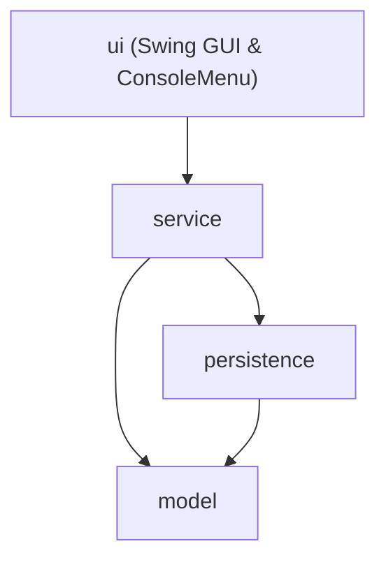

# GameZone Unicesar

Comprehensive inventory, accessories, people, sales, promotions, returns, warranties, and financial balance management system for GameZone Unicesar. Developed as Taller 2 for Programación de Computadores III (SS462), Ingeniería de Sistemas, Universidad Popular del Cesar.

## About

GameZone Unicesar is a specialized video game and console store located in Valledupar's university sector. The system manages the full retail cycle: products (video games and consoles), specialized accessories, customer and seller records, sales transactions, dynamic promotional campaigns, post-sale returns with inventory reintegration, and warranty lifecycle tracking.

The application features both a rich **Java Swing Graphical User Interface (GUI)** and an interactive **Console Menu**, built upon a strict four-layer architecture (`model`, `persistence`, `service`, `ui`), with robust file-based persistence via Java serialization (`ObjectOutputStream`/`ObjectInputStream`), ensuring data integrity across sessions without requiring an external database.

## Architecture

The codebase is organized into four distinct layers under the root package `com.gamezone`, adhering strictly to a one-directional dependency rule: `ui → service → persistence → model`.

- `model`: Domain entities, business value objects, and inheritance hierarchies. Depends on nothing else.
- `persistence`: Repositories and DTO records responsible for saving and loading data files. Depends only on `model`.
- `service`: Business rules, transaction coordination, stock updates, discount algorithms, and reporting. Depends on `model` and `persistence`.
- `ui`: Presentation layer including the Swing graphical interface (`MainFrame`, sub-panels, dialogs) and `ConsoleMenu`. Depends only on `service`.

See the full architectural diagram and rationale in [docs/layers-diagram.md](docs/layers-diagram.md).



### Design Note: Persistence DTO Records

To preserve the strict separation of layers without circular dependencies or foreign layer leakage, persisted transactions do not serialize nested runtime entity graphs. Instead, they leverage dedicated Data Transfer Objects (DTOs):
- `SaleRecord`: Stores references via customer, seller, and product/accessory IDs alongside promotional discount information.
- `ReturnRecord`: Stores the original sale ID, returned product IDs, return date, reason, and refund amount.
- `WarrantyRecord`: Stores warranty details linked to product and sale IDs with start and expiration dates.

Entity resolutions and object-graph reconstructions are executed cleanly within the service layer (`SaleService`, `ReturnService`, `WarrantyService`), preventing desynchronization across files.

## Features & Modules

### 1. Products Management
- **Video Games:** Platform, genre, rating, price, and stock tracking.
- **Consoles:** Brand, model, generation, price, and stock tracking.
- Real-time stock decrement upon sale registration.

### 2. Accessories Management (RE1)
- Specialized accessories extending the domain model:
  - **Controllers:** Wired/wireless connectivity and compatible console model mapping.
  - **Cables:** Length in meters and connector types (HDMI, USB, Optical, etc.).
  - **Memories:** Storage capacity in GB and format (SD, MicroSD, Internal).
- Query accessories by category and verify real-time compatibility with specific console models.

### 3. Promotions & Discounts (RE2)
- Dynamic promotional rules evaluated at checkout:
  - **Percentage Discount:** Flat percentage off the entire transaction.
  - **Category Discount:** Targeted discount applying only to eligible items (e.g., video games only).
  - **Bulk Purchase Discount:** Tiered discount triggered when purchasing a minimum volume of items.
- Automated selection algorithm in `PromotionService.findBestPromotionFor` to grant the highest customer savings.

### 4. Returns & Inventory Reintegration (RE3)
- Formal return processing linked to historical sales.
- **30-day policy rule:** Rejects returns attempted past 30 calendar days from purchase.
- **Item-sale verification:** Ensures only items present in the original sale can be returned.
- **Automated stock restoration:** Restores returned inventory back to active stock via `ProductService.restoreStock`.
- Partial returns supported with automatic refund calculation.

### 5. Warranties Management (RE4)
- **Basic Warranty:** Automatically assigned to console purchases with 6-month coverage at zero additional cost.
- **Extended Warranty:** Optional 12-month comprehensive coverage applied during checkout with a 10% item price surcharge.
- Search warranties by sale or product ID, filter currently active warranties, and monitor warranties expiring within 30 days.

### 6. People Management
- **Customers:** Personal details, contact information, email, and purchase history.
- **Sellers:** Employee code, work shifts, and attended sales history.
- Preloaded staff data on first initialization.

### 7. Reports & Financial Balance
- Complete sales, returns, and warranty audit history.
- **Monthly Financial Balance:** Computes total gross sales, total refunded returns, and net operating revenue for any specified month and year.

### 8. Graphical User Interface (Swing GUI)
- Interactive sidebar navigation with real-time panel switching.
- Dedicated management views: Customers, Sellers, Products, Accessories, Sales, Promotions, Returns, Warranties, and Reports.
- Dynamic search filtering, modal creation forms with input validation, and detailed receipt preview dialogs.

## Requirements

- Java 17 or later
- Maven 3.8 or later

## Build

```bash
mvn clean compile
```

To run unit tests:
```bash
mvn test
```

## Run

Run the application with:
```bash
mvn exec:java
```
Or explicitly:
```bash
mvn exec:java "-Dexec.mainClass=com.gamezone.Main"
```

## Persistent Storage (`data/`)

All data is serialized into binary `.dat` files inside the `data/` folder:
- `data/sellers.dat` (Preloaded with 3 default sellers on first run)
- `data/customers.dat`
- `data/products.dat`
- `data/accessories.dat`
- `data/sales.dat`
- `data/promotions.dat`
- `data/returns.dat`
- `data/warranties.dat`

## Repository Structure

```
GameZoneUnicesar/
├── README.md
├── TEAM.md
├── pom.xml
├── .gitignore
├── data/
│   └── (serialized data files)
├── docs/
│   ├── analysis.md
│   ├── hierarchy-diagram.md
│   ├── class-diagram.md
│   ├── layers-diagram.md
│   └── ai-usage/
│       ├── leader-ai-log.md
│       ├── developer1-ai-log.md
│       └── developer2-ai-log.md
└── src/
    ├── main/
    │   ├── java/
    │   │   └── com/
    │   │       └── gamezone/
    │   │           ├── Main.java
    │   │           ├── model/
    │   │           ├── persistence/
    │   │           ├── service/
    │   │           └── ui/
    │   └── resources/
    │       └── images/
    └── test/
        └── java/
```

## Team

See [TEAM.md](TEAM.md) for detailed role allocations, module ownership, class distribution, and individual committed activities:
- **Merlin Landero (`mlanderoc`):** Technical Lead — Sales, UI (Swing GUI & Console), System Integration & Reports.
- **Carlos Gomez (`craulgomez`):** Developer 1 — Domain Models & Hierarchies (Products, Accessories, Returns, Warranties, Promotions).
- **Héctor Guevara (`Hectorguevara22`):** Developer 2 — Persistence Repositories & Services (People, Accessories, Returns, Warranties, Promotions).

## Documentation & Diagrams

- [TEAM Documentation](TEAM.md)
- [System Analysis](docs/analysis.md)
- [Hierarchy Diagram](docs/hierarchy-diagram.md)
- [Class Diagram](docs/class-diagram.md)
- [Layers Diagram](docs/layers-diagram.md)
- AI Usage Logs: [Technical Lead](docs/ai-usage/leader-ai-log.md), [Developer 1](docs/ai-usage/developer1-ai-log.md), [Developer 2](docs/ai-usage/developer2-ai-log.md)
