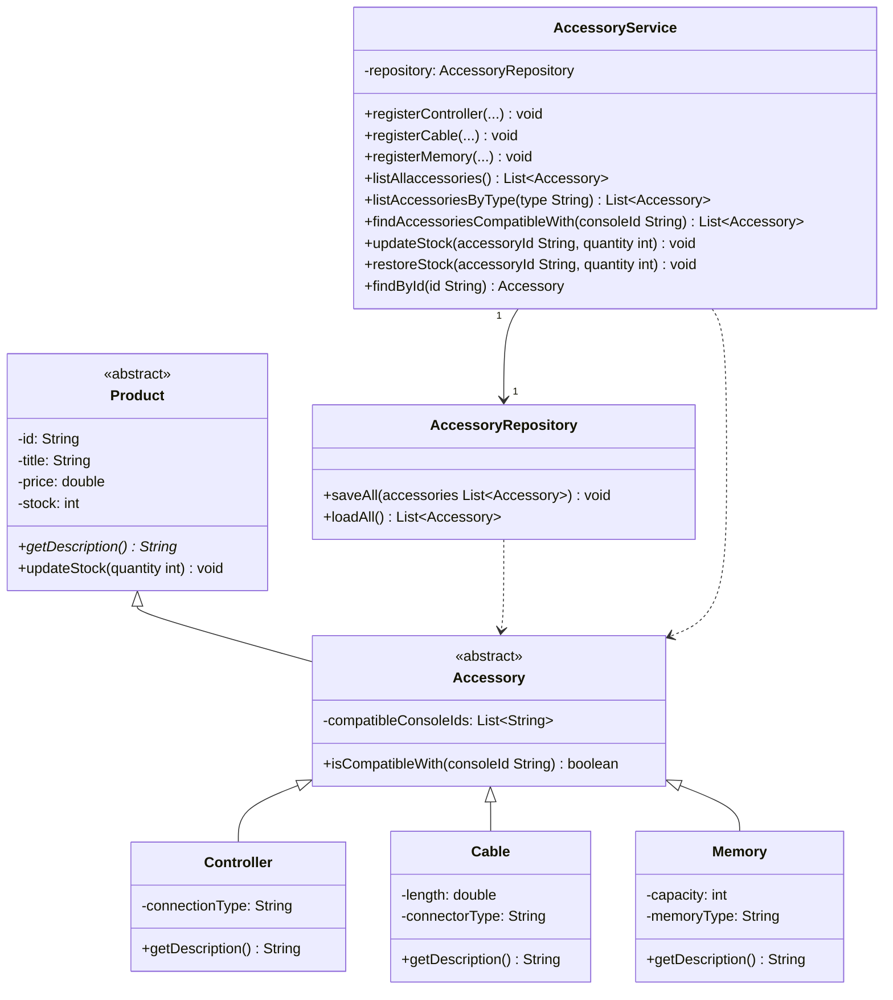

# Accessory Module Class Diagram

```mermaid
classDiagram
    class Product {
        <<abstract>>
        -id: String
        -title: String
        -price: double
        -stock: int
        +getDescription() String*
        +updateStock(quantity int) void
    }
    class Accessory {
        <<abstract>>
        -compatibleConsoleIds: List~String~
        +isCompatibleWith(consoleId String) boolean
    }
    class Controller {
        -connectionType: String
        +getDescription() String
    }
    class Cable {
        -length: double
        -connectorType: String
        +getDescription() String
    }
    class Memory {
        -capacity: int
        -memoryType: String
        +getDescription() String
    }
    class AccessoryRepository {
        +saveAll(accessories List~Accessory~) void
        +loadAll() List~Accessory~
    }
    class AccessoryService {
        -repository: AccessoryRepository
        +registerController(...) void
        +registerCable(...) void
        +registerMemory(...) void
        +listAllaccessories() List~Accessory~
        +listAccessoriesByType(type String) List~Accessory~
        +findAccessoriesCompatibleWith(consoleId String) List~Accessory~
        +updateStock(accessoryId String, quantity int) void
        +restoreStock(accessoryId String, quantity int) void
        +findById(id String) Accessory
    }

    Product <|-- Accessory
    Accessory <|-- Controller
    Accessory <|-- Cable
    Accessory <|-- Memory
    AccessoryRepository ..> Accessory
    AccessoryService "1" --> "1" AccessoryRepository
    AccessoryService ..> Accessory
```
