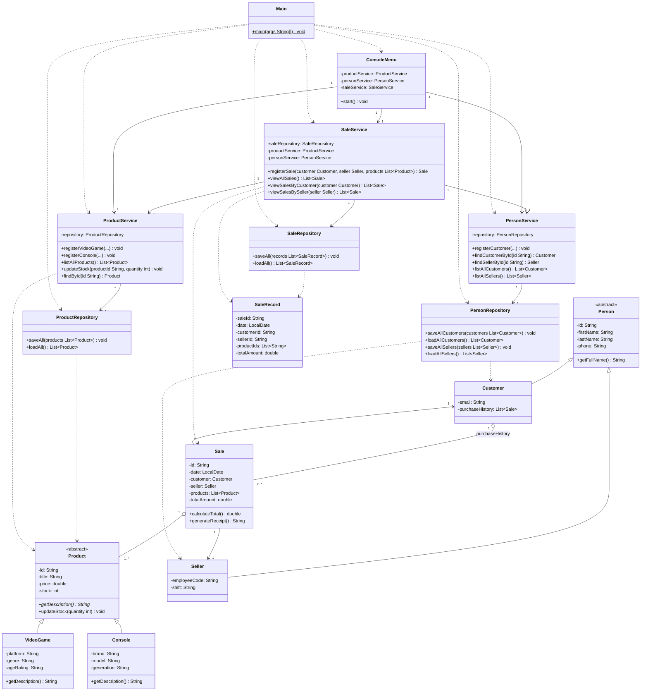

# Class Diagram — GameZone Unicesar

**Layering note:** `SaleRepository` only depends on `SaleRecord`, a plain data-transfer object holding raw ids (customerId, sellerId, productIds) as stored in `data/sales.csv`. The resolution of those ids into full domain objects (`Customer`, `Seller`, `Product`) is done in `SaleService`, which already depends on `ProductService` and `PersonService`. This keeps the dependency direction strictly as `ui → service → persistence → model`, with no reverse dependency from `persistence` to `service`.
