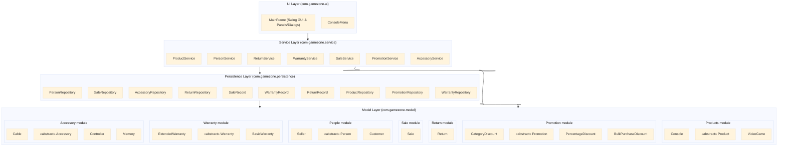

```mermaid
---
config:
  layout: elk
  theme: base
---
flowchart TB
 subgraph UI["UI Layer (com.gamezone.ui)"]
        MainFrame["MainFrame (Swing GUI & Panels/Dialogs)"]
        ConsoleMenu["ConsoleMenu"]
 end
 subgraph Service["Service Layer (com.gamezone.service)"]
        PersonService["PersonService"]
        SaleService["SaleService"]
        ProductService["ProductService"]
        PromotionService["PromotionService"]
        AccessoryService["AccessoryService"]
        ReturnService["ReturnService"]
        WarrantyService["WarrantyService"]
 end
 subgraph DAOLayer["Persistence Layer (com.gamezone.persistence)"]
        SaleRepository["SaleRepository"]
        SaleRecord["SaleRecord"]
        PersonRepository["PersonRepository"]
        ProductRepository["ProductRepository"]
        PromotionRepository["PromotionRepository"]
        AccessoryRepository["AccessoryRepository"]
        ReturnRepository["ReturnRepository"]
        ReturnRecord["ReturnRecord"]
        WarrantyRepository["WarrantyRepository"]
        WarrantyRecord["WarrantyRecord"]
 end
 subgraph ModVentas["Sale module"]
        Sale["Sale"]
 end
 subgraph ModPersonas["People module"]
        Person["«abstract» Person"]
        Customer["Customer"]
        Seller["Seller"]
 end
 subgraph ModProductos["Products module"]
        Product["«abstract» Product"]
        VideoGame["VideoGame"]
        Console["Console"]
 end
 subgraph ModPromociones["Promotion module"]
        Promotion["«abstract» Promotion"]
        PercentageDiscount["PercentageDiscount"]
        CategoryDiscount["CategoryDiscount"]
        BulkPurchaseDiscount["BulkPurchaseDiscount"]
 end
 subgraph ModAccessories["Accessory module"]
        Accessory["«abstract» Accessory"]
        Controller["Controller"]
        Cable["Cable"]
        Memory["Memory"]
 end
 subgraph ModReturns["Return module"]
        Return["Return"]
 end
 subgraph ModWarranties["Warranty module"]
        Warranty["«abstract» Warranty"]
        BasicWarranty["BasicWarranty"]
        ExtendedWarranty["ExtendedWarranty"]
 end
 subgraph Model["Model Layer (com.gamezone.model)"]
        ModVentas
        ModPersonas
        ModProductos
        ModPromociones
        ModAccessories
        ModReturns
        ModWarranties
 end
    UI --> Service
    Service --> DAOLayer & Model
    DAOLayer --> Model

    L_Service_Model_0@{ curve: natural }
```
