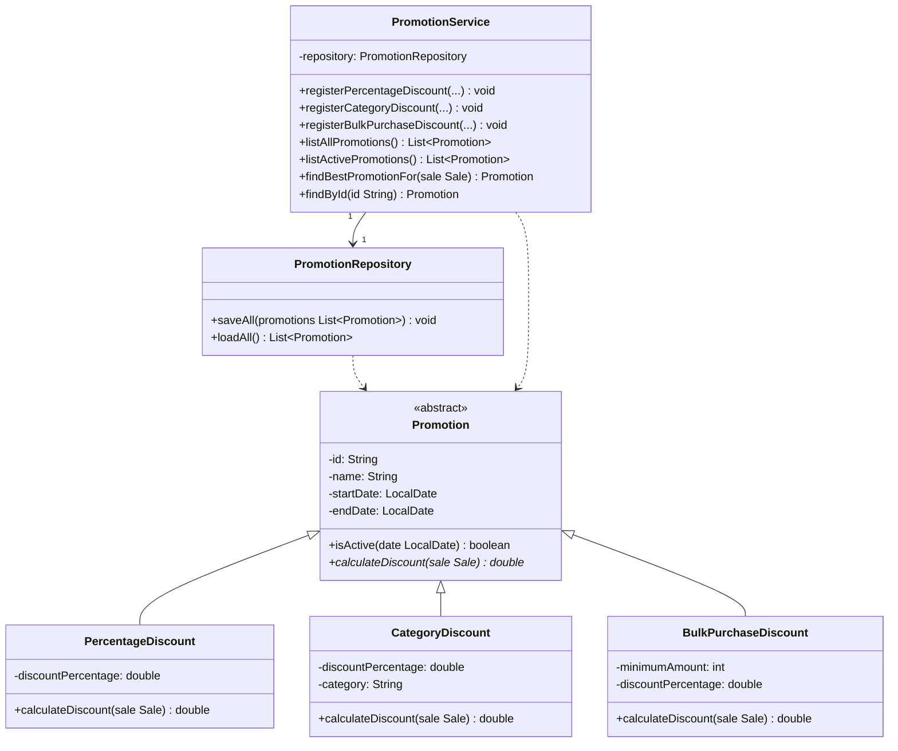

# Promotion Module Class Diagram

```mermaid
classDiagram
    class Promotion {
        <<abstract>>
        -id: String
        -name: String
        -startDate: LocalDate
        -endDate: LocalDate
        +isActive(date LocalDate) boolean
        +calculateDiscount(sale Sale) double*
    }
    class PercentageDiscount {
        -discountPercentage: double
        +calculateDiscount(sale Sale) double
    }
    class CategoryDiscount {
        -discountPercentage: double
        -category: String
        +calculateDiscount(sale Sale) double
    }
    class BulkPurchaseDiscount {
        -minimumAmount: int
        -discountPercentage: double
        +calculateDiscount(sale Sale) double
    }
    class PromotionRepository {
        +saveAll(promotions List~Promotion~) void
        +loadAll() List~Promotion~
    }
    class PromotionService {
        -repository: PromotionRepository
        +registerPercentageDiscount(...) void
        +registerCategoryDiscount(...) void
        +registerBulkPurchaseDiscount(...) void
        +listAllPromotions() List~Promotion~
        +listActivePromotions() List~Promotion~
        +findBestPromotionFor(sale Sale) Promotion
        +findById(id String) Promotion
    }

    Promotion <|-- PercentageDiscount
    Promotion <|-- CategoryDiscount
    Promotion <|-- BulkPurchaseDiscount
    PromotionRepository ..> Promotion
    PromotionService "1" --> "1" PromotionRepository
    PromotionService ..> Promotion
```
