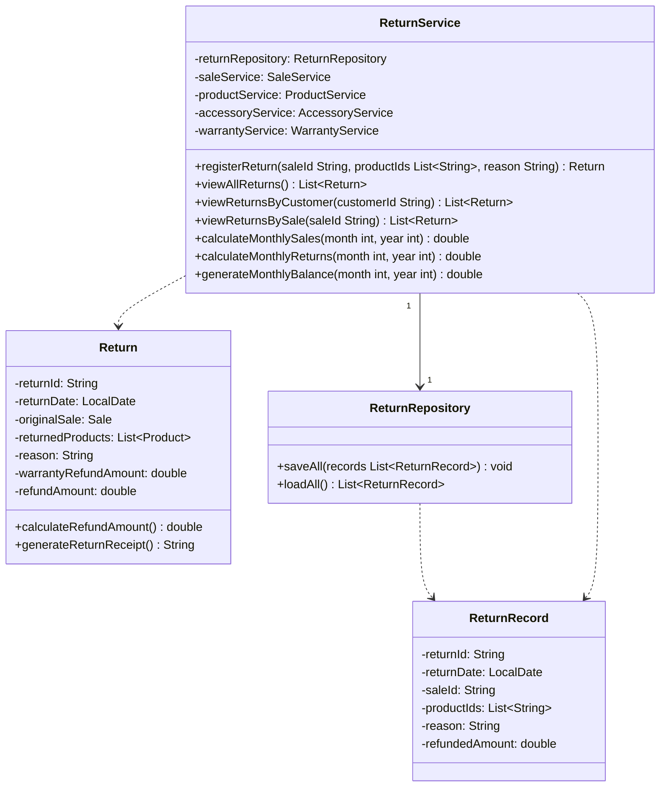

# Return Module Class Diagram

```mermaid
classDiagram
    class Return {
        -returnId: String
        -returnDate: LocalDate
        -originalSale: Sale
        -returnedProducts: List~Product~
        -reason: String
        -warrantyRefundAmount: double
        -refundAmount: double
        +calculateRefundAmount() double
        +generateReturnReceipt() String
    }
    class ReturnRecord {
        -returnId: String
        -returnDate: LocalDate
        -saleId: String
        -productIds: List~String~
        -reason: String
        -refundedAmount: double
    }
    class ReturnRepository {
        +saveAll(records List~ReturnRecord~) void
        +loadAll() List~ReturnRecord~
    }
    class ReturnService {
        -returnRepository: ReturnRepository
        -saleService: SaleService
        -productService: ProductService
        -accessoryService: AccessoryService
        -warrantyService: WarrantyService
        +registerReturn(saleId String, productIds List~String~, reason String) Return
        +viewAllReturns() List~Return~
        +viewReturnsByCustomer(customerId String) List~Return~
        +viewReturnsBySale(saleId String) List~Return~
        +calculateMonthlySales(month int, year int) double
        +calculateMonthlyReturns(month int, year int) double
        +generateMonthlyBalance(month int, year int) double
    }

    ReturnRepository ..> ReturnRecord
    ReturnService "1" --> "1" ReturnRepository
    ReturnService ..> Return
    ReturnService ..> ReturnRecord
```
