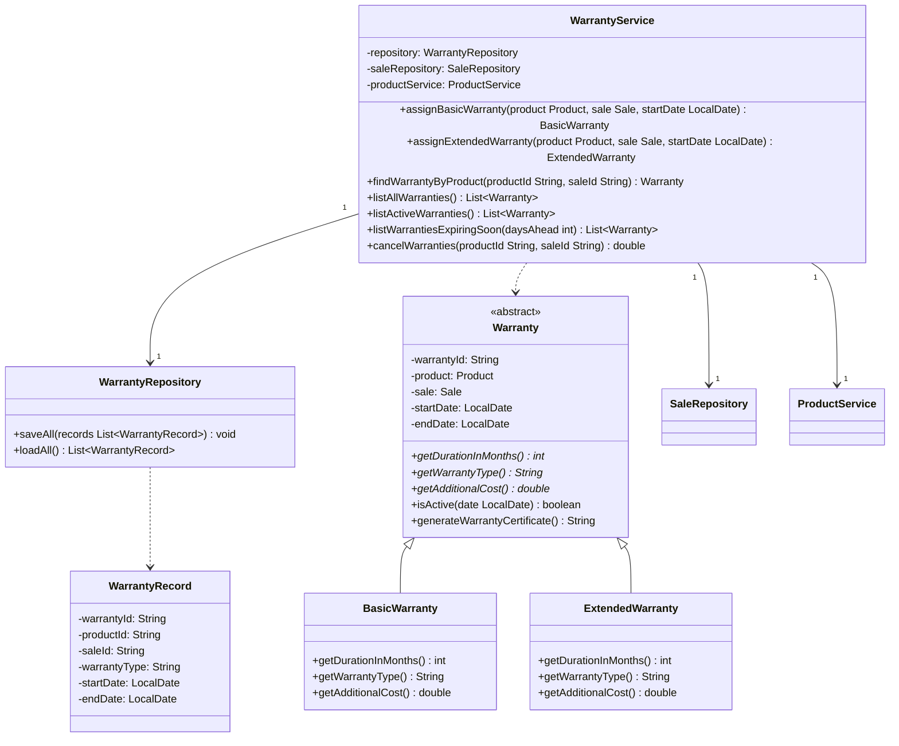

# Warranty Module Class Diagram

```mermaid
classDiagram
    class Warranty {
        <<abstract>>
        -warrantyId: String
        -product: Product
        -sale: Sale
        -startDate: LocalDate
        -endDate: LocalDate
        +getDurationInMonths() int*
        +getWarrantyType() String*
        +getAdditionalCost() double*
        +isActive(date LocalDate) boolean
        +generateWarrantyCertificate() String
    }

    class BasicWarranty {
        +getDurationInMonths() int
        +getWarrantyType() String
        +getAdditionalCost() double
    }

    class ExtendedWarranty {
        +getDurationInMonths() int
        +getWarrantyType() String
        +getAdditionalCost() double
    }

    class WarrantyRecord {
        -warrantyId: String
        -productId: String
        -saleId: String
        -warrantyType: String
        -startDate: LocalDate
        -endDate: LocalDate
    }

    class WarrantyRepository {
        +saveAll(records List~WarrantyRecord~) void
        +loadAll() List~WarrantyRecord~
    }

    class WarrantyService {
        -repository: WarrantyRepository
        -saleRepository: SaleRepository
        -productService: ProductService
        +assignBasicWarranty(product Product, sale Sale, startDate LocalDate) BasicWarranty
        +assignExtendedWarranty(product Product, sale Sale, startDate LocalDate) ExtendedWarranty
        +findWarrantyByProduct(productId String, saleId String) Warranty
        +listAllWarranties() List~Warranty~
        +listActiveWarranties() List~Warranty~
        +listWarrantiesExpiringSoon(daysAhead int) List~Warranty~
        +cancelWarranties(productId String, saleId String) double
    }

    Warranty <|-- BasicWarranty
    Warranty <|-- ExtendedWarranty
    WarrantyRepository ..> WarrantyRecord
    WarrantyService "1" --> "1" WarrantyRepository
    WarrantyService "1" --> "1" SaleRepository
    WarrantyService "1" --> "1" ProductService
    WarrantyService ..> Warranty
```
